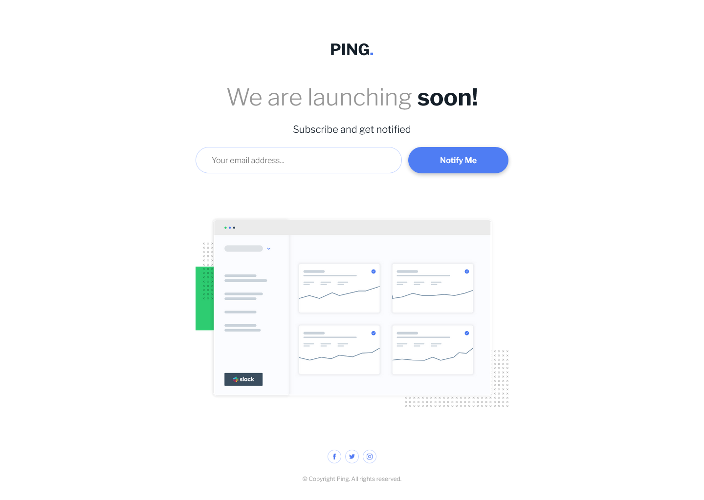
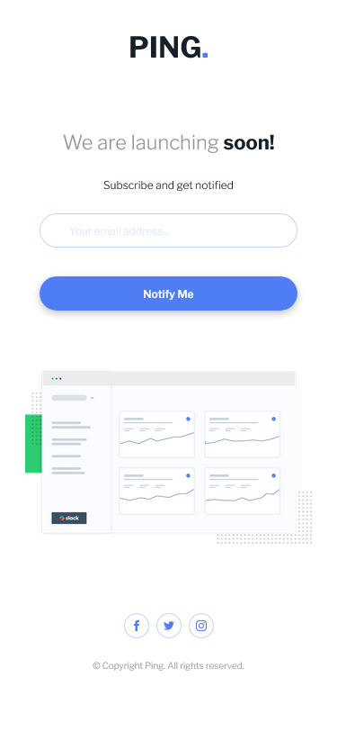

# Frontend Mentor - Ping coming soon page solution

This is a solution to the [Ping coming soon page challenge on Frontend Mentor](https://www.frontendmentor.io/challenges/ping-single-column-coming-soon-page-5cadd051fec04111f7b848da). Frontend Mentor challenges help you improve your coding skills by building realistic projects. 

## Table of contents

- [Overview](#overview)
  - [The challenge](#the-challenge)
  - [Screenshot](#screenshot)
  - [Links](#links)
- [My process](#my-process)
  - [Built with](#built-with)
  - [What I learned](#what-i-learned)
  - [Continued development](#continued-development)
  - [Useful resources](#useful-resources)
- [Author](#author)

## Overview

### The challenge

Users should be able to:

- View the optimal layout for the site depending on their device's screen size
- See hover states for all interactive elements on the page
- Submit their email address using an `input` field
- Receive an error message when the `form` is submitted if:
  - The `input` field is empty. The message for this error should say *"Whoops! It looks like you forgot to add your email"*
  - The email address is not formatted correctly (i.e. a correct email address should have this structure: `name@host.tld`). The message for this error should say *"Please provide a valid email address"*

### Screenshot

*Desktop preview*: 

*Mobile preview*: 

### Links

- Solution URL: [Add solution URL here](https://your-solution-url.com)
- Live Site URL: [Add live site URL here](https://your-live-site-url.com)

## My process

### Built with

- Semantic HTML5 markup
- SCSS/CSS custom properties, transitions and animations
- BEM methodology
- Flexbox & CSS Grid
- Mobile-first workflow
- Plain JavaScript
- GSAP library animations
- Parcel bundler

### What I learned

I've learned how to make simple animations using GSAP library. I'll probably use them in most of my future projects to become more and more advanced in it.

### Continued development

I will come back to all of my projects in the future to build them with other, more advanced tools for building web applications such as libraries, frameworks etc.

### Useful resources

- [DesignCourse YT channel](https://www.youtube.com/channel/UCVyRiMvfUNMA1UPlDPzG5Ow) - I watched some of the tutorials about GSAP to learn more about this library. 

## Author

- GitHub - [GrzywN (Karol Binkowski) · GitHub](https://github.com/GrzywN)
- Frontend Mentor - [@GrzywN](https://www.frontendmentor.io/profile/GrzywN)
- Discord - fansik#2808
